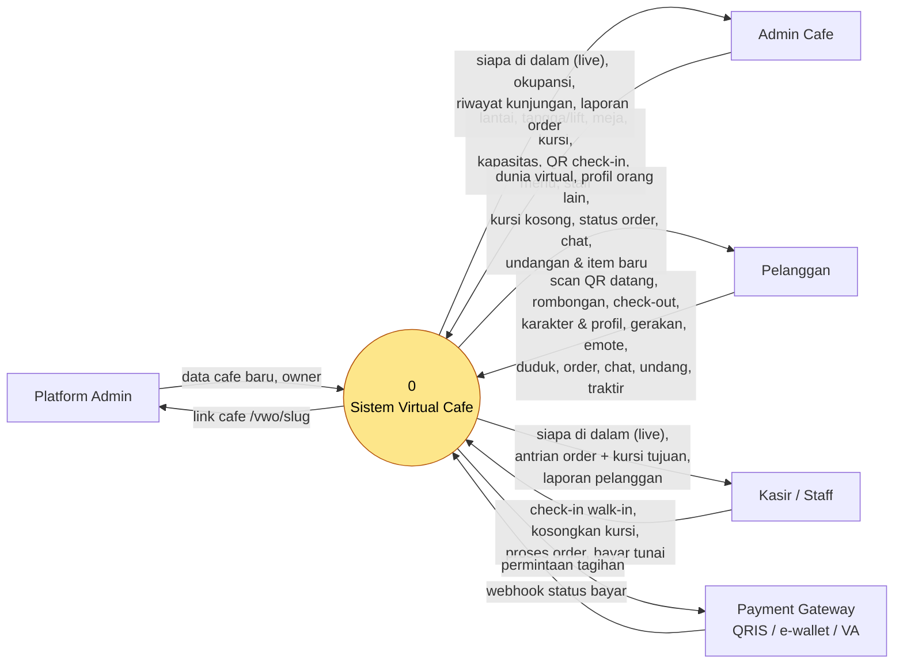
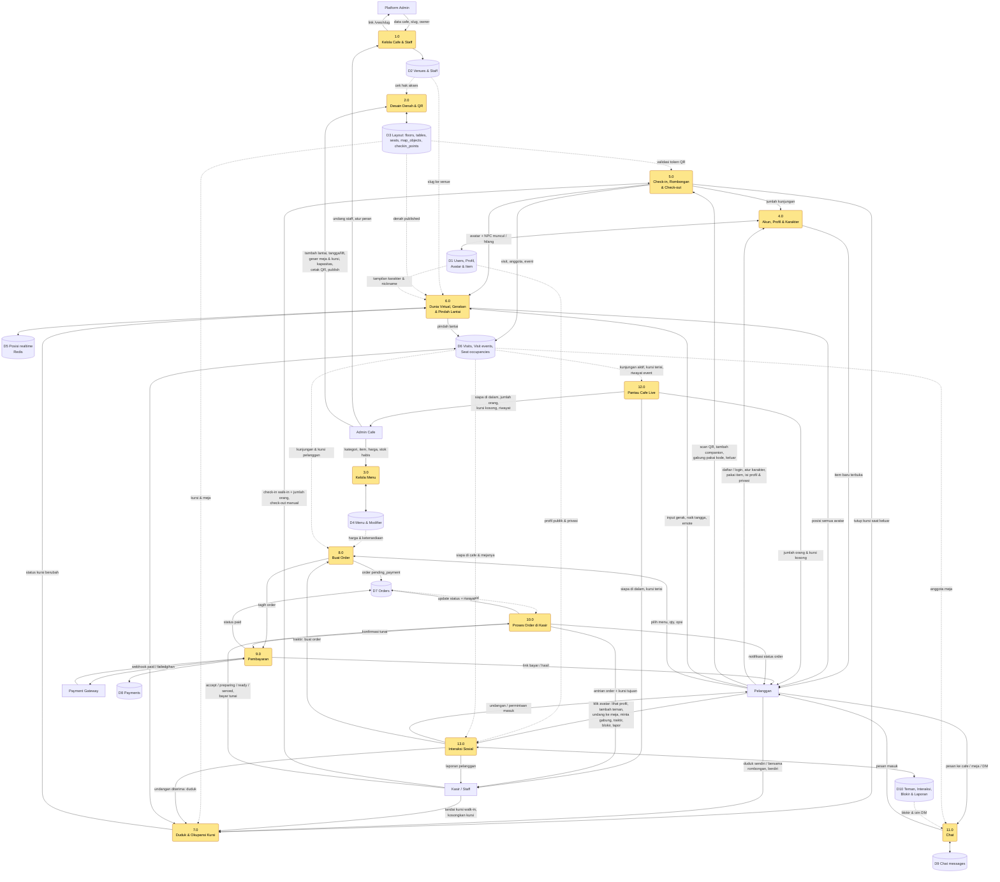

# DFD: Virtual Cafe World (VWO)

Versi: 0.4 (draft) · 2026-10-07

Cafe virtual adalah cermin dari cafe fisik: kursi di aplikasi = kursi sungguhan, satu kursi untuk satu orang, dan setiap orang yang datang dan keluar tercatat. Cafe bisa punya banyak lantai, dan satu pelanggan bisa datang bersama rombongan yang anggotanya tampil sebagai NPC.

Notasi: persegi = entitas eksternal, persegi bulat = proses, silinder = data store. Gambar render: [dfd-level0.svg](dfd-level0.svg), [dfd-level1.svg](dfd-level1.svg).

## Level 0 (diagram konteks)

## Level 1

## Penjelasan proses

| No | Proses | Input utama | Output utama | Store |
|---|---|---|---|---|
| 1.0 | Kelola Cafe & Staff | Platform admin membuat cafe dan slug; owner mengundang staff | Link `domain.com/vwo/{slug}` | D2 |
| 2.0 | Desain Denah & QR | Admin menaruh, menggeser, memutar meja/kursi/dekor; atur kapasitas; cetak QR pintu dan meja; publish | Layout versi baru, QR check-in | D3 |
| 3.0 | Kelola Menu | Kategori, item, harga, opsi, tanda habis | Menu yang dilihat pelanggan | D4 |
| 4.0 | Akun, Profil & Karakter | Registrasi/login, pilih badan dan warna kulit, pakai item per slot, isi nickname/bio/minat, atur privasi | Karakter dan profil publik; item terbuka dari jumlah kunjungan | D1 |
| 5.0 | Check-in, Rombongan & Check-out | Scan QR, tambah companion, gabung pakai kode rombongan, tombol keluar, input staff, aturan otomatis | Kunjungan + anggota dibuka/ditutup, event tercatat | D6 |
| 6.0 | Dunia Virtual, Gerakan & Pindah Lantai | Input gerak, masuk tangga/lift, emote (lambai, cheers) | Posisi avatar dan NPC ke semua orang di lantai yang sama; lantai aktif anggota | D5, D6 |
| 7.0 | Duduk & Okupansi | Duduk sendiri atau sekaligus satu rombongan, berdiri, staff tandai/kosongkan | Kursi terisi / kosong, broadcast | D6 |
| 8.0 | Buat Order | Item + qty + opsi + catatan | Order `pending_payment` dengan snapshot harga | D7 |
| 9.0 | Pembayaran | Tagihan ke gateway, webhook, konfirmasi tunai | Order jadi `paid` | D8, D7 |
| 10.0 | Proses Order di Kasir | Order `paid` masuk antrian; kasir mengubah status | Status order ke pelanggan | D7 |
| 11.0 | Chat | Pesan ke seluruh cafe, ke meja, atau DM | Pesan real-time + riwayat | D9 |
| 12.0 | Pantau Cafe Live | Kunjungan, anggota aktif, dan okupansi dari D6 | Per lantai: siapa di dalam (dikelompokkan per rombongan), jumlah orang, kursi kosong, riwayat datang/keluar | D6 |
| 13.0 | Interaksi Sosial | Klik avatar orang lain: lihat profil, tambah teman, undang ke meja, minta gabung meja, traktir, blokir, lapor | Undangan/permintaan ke penerima, duduk bersama, order traktir, laporan ke staff | D10, D1, D6 |

## Alur kunci (urutan)

**Datang (check-in)**

1. Pelanggan scan QR di pintu masuk atau di meja. QR berisi token yang berganti tiap beberapa menit (ditandatangani dengan `checkin_points.secret_key`), jadi foto QR lama tidak bisa dipakai dari rumah.
2. Server memvalidasi token, membuat `visits` berstatus `checked_in`, mencatat `visit_events.check_in`.
3. Avatar muncul di dunia virtual di titik masuk (atau langsung di kursi jika scan QR meja dan kursi kosong).
4. Layar admin dan kasir (12.0) langsung menampilkan orang itu di daftar "di dalam cafe".
5. Tamu tanpa aplikasi: kasir menekan "check-in walk-in", isi nama/jumlah orang, lalu memilih kursinya. Tetap tercatat sebagai kunjungan.

**Datang bersama rombongan**

1. Host check-in seperti biasa, lalu mengisi "datang berapa orang" (misal 6). Sistem membuat 1 anggota `host` dan 5 anggota `companion` dengan nama default (Tamu 1 sampai 5) dan avatar acak yang bisa diubah host.
2. Companion tampil sebagai NPC yang mengikuti host (`follows_member_id`) saat berjalan dan naik tangga.
3. Anggota keluarga yang punya aplikasi bisa scan QR lalu memasukkan `group_code` rombongan. Dia mengambil alih satu slot companion (jadi `app_user`) dan bisa bergerak sendiri, order, dan chat.
4. Anggota bisa pulang lebih dulu: host menekan "anggota pulang" atau anggota `app_user` menekan keluar. Hanya anggota itu yang ditutup (`left_at`) dan kursinya dikosongkan.
5. Walk-in tanpa aplikasi: kasir check-in dengan jumlah orang, sistem membuat host tanpa akun ditambah companion.

**Duduk di kursi**

1. Sendiri: client mengirim `seat.claim([seat_id])`. Bersama rombongan: host memilih meja, client mengirim `seat.claim` berisi daftar kursi dan anggota, misal 6 kursi di meja M-05.
2. Server insert semua `seat_occupancies` dalam satu transaksi. Jika satu kursi saja sudah terisi, semuanya dibatalkan, dan server menawarkan meja lain yang cukup atau membagi rombongan ke meja bersebelahan.
3. Jika berhasil, catat `visit_events.seat_claim` per anggota dan broadcast `seat.updated` ke semua orang di lantai itu. NPC berjalan ke kursinya lalu duduk.

**Interaksi dengan pelanggan lain**

1. Pelanggan mengetuk avatar orang lain dan melihat kartu profil: nickname, karakter, bio, minat, status (terbuka untuk ngobrol / sibuk / jangan ganggu), dan teman bersama. Email dan nama asli tidak pernah ditampilkan.
2. Dari kartu itu ada aksi: sapa (emote), chat langsung (jika `dm_policy` mengizinkan), tambah teman, undang ke meja saya, minta gabung meja dia, atau traktir minuman.
3. Undangan dan permintaan disimpan di `interactions` dengan masa berlaku (misal 5 menit) dan dikirim real-time ke penerima. Server menolak jika penerima memblokir pengirim atau berstatus jangan ganggu.
4. Jika undangan meja diterima, server menjalankan alur duduk (7.0) untuk kursi kosong di meja itu. Jika meja penuh, undangan gagal dengan pesan jelas.
5. Traktir: pengirim memilih menu dan membayar; order dibuat dengan `recipient_user_id` dan diantar ke kursi penerima. Penerima bisa menolak sebelum dibayar.
6. Emote (lambai, cheers, tertawa) hanya lewat realtime dan tidak disimpan.
7. Blokir langsung menyembunyikan chat dan aksi dari orang itu. Laporan masuk ke layar staff cafe.

**Pindah lantai**

1. Avatar berjalan ke objek `stairs` atau `elevator`. Server memindahkan anggota (dan NPC yang mengikutinya) ke `target_floor_id` di titik `target_x, target_y`.
2. `visit_members.current_floor_id` diperbarui, event `floor_change` dicatat, client berpindah room realtime ke lantai baru.
3. Live view per lantai ikut terbarui. Anggota yang duduk dianggap berada di lantai kursinya.

**Keluar (check-out)**

Kunjungan ditutup oleh salah satu dari:

| Cara | Siapa | `checkout_method` |
|---|---|---|
| Tombol "Keluar dari cafe" di aplikasi | Pelanggan | `self` |
| Kasir menutup kunjungan atau mengosongkan meja | Staff | `staff` |
| Tidak duduk dan tidak ada heartbeat aplikasi selama batas waktu (default 30 menit) | Sistem | `auto_idle` |
| Jam tutup cafe | Sistem | `auto_closing` |

Saat ditutup: `checked_out_at` diisi, semua kursi milik kunjungan dikosongkan, event `check_out` atau `auto_check_out` dicatat, avatar hilang, dan layar live diperbarui.

**Order sampai diantar**

1. Pelanggan yang sudah check-in dan duduk membuka menu dan checkout (8.0). Server menghitung ulang total dari D4, tidak percaya harga dari client.
2. 9.0 membuat tagihan di gateway, pelanggan membayar (misal QRIS), gateway mengirim webhook yang diverifikasi dan diproses idempoten lewat `provider_ref`.
3. Order berubah ke `paid` dan langsung muncul di layar kasir (10.0) dengan nomor order dan kursi tujuan.
4. Kasir menekan accept, preparing, ready, served. Setiap perubahan dicatat di `order_status_events` dan dikirim ke pelanggan.
