# ERD: Virtual Cafe World (VWO)

Versi: 0.4 (draft) · 2026-10-07

Target database: PostgreSQL. Semua tabel milik tenant membawa `venue_id` supaya satu database bisa melayani banyak cafe (multi-tenant). Posisi avatar yang bergerak real-time **tidak** disimpan di sini, melainkan di Redis / memori server realtime (lihat [DESIGN-NOTES.md](DESIGN-NOTES.md)).

Gambar render: [erd.svg](erd.svg)

## Diagram lengkap

```mermaid
erDiagram
    USERS ||--o| AVATARS : "punya"
    USERS ||--o| PROFILES : "profil publik"
    AVATARS ||--o{ AVATAR_EQUIPPED : "memakai"
    AVATAR_ITEMS ||--o{ AVATAR_EQUIPPED : "dipakai di"
    VENUES |o--o{ AVATAR_ITEMS : "item eksklusif cafe"
    USERS ||--o{ USER_INVENTORY : "memiliki"
    AVATAR_ITEMS ||--o{ USER_INVENTORY : "dimiliki"
    USERS ||--o{ FRIENDSHIPS : "meminta"
    USERS ||--o{ FRIENDSHIPS : "diminta"
    VENUES ||--o{ INTERACTIONS : "terjadi di"
    USERS ||--o{ INTERACTIONS : "mengirim"
    USERS |o--o{ INTERACTIONS : "menerima"
    CAFE_TABLES |o--o{ INTERACTIONS : "undangan meja"
    ORDERS |o--o| INTERACTIONS : "traktir"
    USERS ||--o{ USER_REPORTS : "melaporkan"
    CHAT_MESSAGES |o--o{ USER_REPORTS : "bukti"
    USERS ||--o{ VENUE_MEMBERS : "jadi staff di"
    VENUES ||--o{ VENUE_MEMBERS : "punya staff"

    VENUES ||--o{ FLOORS : "punya denah"
    FLOORS ||--o{ CAFE_TABLES : "berisi"
    FLOORS ||--o{ MAP_OBJECTS : "berisi dekor"
    CAFE_TABLES ||--o{ SEATS : "punya kursi"
    FLOORS ||--o{ SEATS : "berisi"
    FLOORS |o--o{ MAP_OBJECTS : "tujuan tangga / lift"

    VENUES ||--o{ CHECKIN_POINTS : "punya QR"
    FLOORS |o--o{ CHECKIN_POINTS : "terpasang di"
    CAFE_TABLES |o--o{ CHECKIN_POINTS : "QR meja"
    VENUES ||--o{ VISITS : "dikunjungi"
    USERS |o--o{ VISITS : "host check-in"
    CHECKIN_POINTS |o--o{ VISITS : "check-in lewat"
    VISITS ||--|{ VISIT_MEMBERS : "rombongan"
    USERS |o--o{ VISIT_MEMBERS : "anggota beraplikasi"
    VISIT_MEMBERS |o--o{ VISIT_MEMBERS : "NPC mengikuti"
    FLOORS |o--o{ VISIT_MEMBERS : "sedang di lantai"
    VISITS ||--o{ VISIT_EVENTS : "log datang-keluar"
    VISIT_MEMBERS ||--o{ SEAT_OCCUPANCIES : "duduk"
    SEATS ||--o{ SEAT_OCCUPANCIES : "diduduki"
    VISIT_MEMBERS |o--o{ ORDER_ITEMS : "untuk siapa"
    VISITS |o--o{ ORDERS : "order selama kunjungan"

    VENUES ||--o{ MENU_CATEGORIES : "punya"
    MENU_CATEGORIES ||--o{ MENU_ITEMS : "berisi"
    VENUES ||--o{ MODIFIER_GROUPS : "punya"
    MODIFIER_GROUPS ||--o{ MODIFIER_OPTIONS : "berisi"
    MENU_ITEMS ||--o{ MENU_ITEM_MODIFIER_GROUPS : ""
    MODIFIER_GROUPS ||--o{ MENU_ITEM_MODIFIER_GROUPS : ""

    VENUES ||--o{ ORDERS : "menerima"
    USERS ||--o{ ORDERS : "memesan"
    SEATS |o--o{ ORDERS : "diantar ke"
    ORDERS ||--|{ ORDER_ITEMS : "berisi"
    MENU_ITEMS ||--o{ ORDER_ITEMS : "dipesan sebagai"
    ORDER_ITEMS ||--o{ ORDER_ITEM_MODIFIERS : "dengan"
    MODIFIER_OPTIONS ||--o{ ORDER_ITEM_MODIFIERS : "dipilih"
    ORDERS ||--o{ ORDER_STATUS_EVENTS : "riwayat status"
    ORDERS ||--o{ PAYMENTS : "dibayar lewat"

    VENUES ||--o{ CHAT_CHANNELS : "punya"
    CAFE_TABLES |o--o| CHAT_CHANNELS : "chat meja"
    CHAT_CHANNELS ||--o{ CHAT_CHANNEL_MEMBERS : "anggota"
    USERS ||--o{ CHAT_CHANNEL_MEMBERS : "ikut"
    CHAT_CHANNELS ||--o{ CHAT_MESSAGES : "berisi"
    USERS ||--o{ CHAT_MESSAGES : "mengirim"
    USERS ||--o{ USER_BLOCKS : "memblokir"

    USERS {
        uuid id PK
        string email UK
        string password_hash "null jika login OAuth"
        string display_name
        enum platform_role "user | super_admin"
        timestamptz created_at
    }
    PROFILES {
        uuid user_id PK,FK
        string nickname "nama yang tampil di atas avatar"
        string bio
        string_array interests "kopi, musik, coding"
        enum social_status "open_to_chat | busy | do_not_disturb"
        enum dm_policy "everyone | friends | nobody"
        boolean accept_table_invites
        boolean show_in_live_list "tampil di daftar 'siapa di dalam' untuk pelanggan lain"
        timestamptz updated_at
    }
    AVATARS {
        uuid id PK
        uuid user_id FK,UK
        enum body_type "a | b | c"
        string skin_tone "kode warna dari palet"
        jsonb appearance_cache "hasil gabungan untuk render cepat"
        timestamptz updated_at
    }
    AVATAR_ITEMS {
        uuid id PK
        uuid venue_id FK "null = item global"
        enum slot "hair | face | eyewear | hat | top | bottom | shoes | back | accessory | held"
        string name
        string sprite_key
        string_array color_options
        enum rarity "common | rare | epic"
        enum unlock_type "default | visit_count | purchase | event | staff_grant"
        int unlock_value "mis. 5 kunjungan"
        boolean is_active
    }
    AVATAR_EQUIPPED {
        uuid avatar_id PK,FK
        enum slot PK
        uuid item_id FK
        string color
    }
    USER_INVENTORY {
        uuid user_id PK,FK
        uuid item_id PK,FK
        enum source "default | reward | purchase | gift"
        timestamptz acquired_at
    }
    FRIENDSHIPS {
        uuid id PK
        uuid requester_user_id FK
        uuid addressee_user_id FK
        enum status "pending | accepted | declined"
        uuid met_at_venue_id FK "bertemu di cafe mana"
        timestamptz created_at
        timestamptz responded_at
    }
    INTERACTIONS {
        uuid id PK
        uuid venue_id FK
        uuid from_user_id FK
        uuid to_user_id FK "null = ke semua orang di sekitar"
        enum type "table_invite | join_table_request | treat"
        uuid table_id FK
        uuid order_id FK "untuk traktir"
        enum status "pending | accepted | declined | expired | cancelled"
        string message
        timestamptz created_at
        timestamptz expires_at
        timestamptz responded_at
    }
    USER_REPORTS {
        uuid id PK
        uuid venue_id FK
        uuid reporter_user_id FK
        uuid reported_user_id FK
        uuid chat_message_id FK
        enum reason "spam | harassment | inappropriate | other"
        text detail
        enum status "open | reviewed | action_taken | dismissed"
        uuid handled_by_user_id FK "staff cafe"
        timestamptz created_at
    }
    VENUES {
        uuid id PK
        string slug UK "domain.com/vwo/{slug}"
        string name
        text description
        string timezone
        string currency "IDR"
        decimal tax_rate
        decimal service_rate
        jsonb opening_hours "untuk auto check-out saat tutup"
        int idle_checkout_minutes "default 30"
        enum status "draft | open | closed | archived"
        uuid owner_user_id FK
        timestamptz created_at
    }
    VENUE_MEMBERS {
        uuid venue_id PK,FK
        uuid user_id PK,FK
        enum role "owner | admin | cashier | staff"
        timestamptz created_at
    }
    FLOORS {
        uuid id PK
        uuid venue_id FK
        string name "Lantai 1, Rooftop"
        int width "dalam tile"
        int height "dalam tile"
        int tile_size "px per tile"
        string background_url
        int sort_order
        int layout_version "naik tiap publish"
        enum status "draft | published"
    }
    CAFE_TABLES {
        uuid id PK
        uuid floor_id FK
        uuid venue_id FK
        string label "M-01"
        enum shape "round | square | rect | bar"
        decimal x
        decimal y
        decimal width
        decimal height
        int rotation "derajat"
        string sprite_key
        boolean is_active
    }
    SEATS {
        uuid id PK
        uuid floor_id FK
        uuid table_id FK "null untuk kursi bar/sofa lepas"
        uuid venue_id FK
        string label "M-01-A"
        decimal x
        decimal y
        int rotation
        string sprite_key
        boolean is_active
    }
    MAP_OBJECTS {
        uuid id PK
        uuid floor_id FK
        uuid venue_id FK
        enum type "wall | counter | door | decor | spawn_point | blocked | stairs | elevator"
        decimal x
        decimal y
        decimal width
        decimal height
        int rotation
        string sprite_key
        boolean is_walkable
        uuid target_floor_id FK "untuk stairs / elevator"
        decimal target_x "titik muncul di lantai tujuan"
        decimal target_y
        jsonb properties
    }
    CHECKIN_POINTS {
        uuid id PK
        uuid venue_id FK
        uuid floor_id FK
        uuid table_id FK "null untuk QR pintu masuk"
        enum type "entrance | table"
        string label "Pintu depan, Meja M-03"
        string secret_key "untuk token QR yang berganti"
        boolean is_active
    }
    VISITS {
        uuid id PK
        uuid venue_id FK
        uuid user_id FK "host; null = walk-in dicatat staff"
        string group_code UK "kode gabung rombongan, aktif selama kunjungan"
        enum status "checked_in | checked_out"
        enum checkin_method "qr_entrance | qr_table | staff"
        uuid checkin_point_id FK
        uuid checked_in_by_user_id FK "staff, jika manual"
        timestamptz checked_in_at
        timestamptz last_heartbeat_at
        enum checkout_method "self | staff | auto_idle | auto_closing"
        uuid checked_out_by_user_id FK
        timestamptz checked_out_at "null = masih di dalam"
    }
    VISIT_MEMBERS {
        uuid id PK
        uuid visit_id FK
        uuid venue_id FK
        uuid user_id FK "null untuk companion / NPC"
        enum member_type "host | app_user | companion"
        string display_name "Ayah, Ibu, Adik"
        jsonb avatar_appearance "untuk companion; app_user pakai avatar akunnya"
        uuid follows_member_id FK "companion mengikuti anggota ini"
        uuid current_floor_id FK
        timestamptz joined_at
        timestamptz left_at "null = masih di dalam"
    }
    VISIT_EVENTS {
        uuid id PK
        uuid visit_id FK
        uuid visit_member_id FK "null jika event untuk seluruh rombongan"
        uuid venue_id FK
        enum type "check_in | member_join | member_leave | floor_change | seat_claim | seat_release | order_placed | check_out | auto_check_out | staff_override"
        uuid floor_id FK
        uuid seat_id FK
        uuid actor_user_id FK "pelanggan, staff, atau null untuk sistem"
        jsonb meta
        timestamptz created_at
    }
    SEAT_OCCUPANCIES {
        uuid id PK
        uuid seat_id FK
        uuid visit_id FK
        uuid visit_member_id FK "satu kursi = satu anggota"
        uuid venue_id FK
        enum source "self | host | staff"
        timestamptz started_at
        timestamptz ended_at "null = masih duduk"
        enum end_reason "stand_up | check_out | staff_clear | auto"
    }
    MENU_CATEGORIES {
        uuid id PK
        uuid venue_id FK
        string name
        int sort_order
        boolean is_active
    }
    MENU_ITEMS {
        uuid id PK
        uuid venue_id FK
        uuid category_id FK
        string name
        text description
        decimal price
        string image_url
        boolean is_available "habis / tersedia"
        int sort_order
        timestamptz deleted_at "soft delete"
    }
    MODIFIER_GROUPS {
        uuid id PK
        uuid venue_id FK
        string name "Ukuran, Level gula"
        int min_select
        int max_select
    }
    MODIFIER_OPTIONS {
        uuid id PK
        uuid group_id FK
        string name "Large, Less sugar"
        decimal price_delta
        boolean is_available
    }
    MENU_ITEM_MODIFIER_GROUPS {
        uuid menu_item_id PK,FK
        uuid modifier_group_id PK,FK
        int sort_order
    }
    ORDERS {
        uuid id PK
        uuid venue_id FK
        uuid customer_user_id FK "yang membayar"
        uuid recipient_user_id FK "null = untuk diri / rombongan; diisi saat traktir"
        uuid seat_id FK "tujuan antar"
        uuid visit_id FK
        string order_number "per venue per hari, mis. A-042"
        enum status "pending_payment | paid | accepted | preparing | ready | served | cancelled | refunded"
        decimal subtotal
        decimal tax_amount
        decimal service_amount
        decimal total
        text note
        timestamptz created_at
        timestamptz updated_at
    }
    ORDER_ITEMS {
        uuid id PK
        uuid order_id FK
        uuid menu_item_id FK
        string name_snapshot
        decimal unit_price_snapshot
        int quantity
        decimal line_total
        uuid for_member_id FK "opsional: pesanan untuk anggota mana"
        text note
    }
    ORDER_ITEM_MODIFIERS {
        uuid id PK
        uuid order_item_id FK
        uuid modifier_option_id FK
        string name_snapshot
        decimal price_delta_snapshot
    }
    ORDER_STATUS_EVENTS {
        uuid id PK
        uuid order_id FK
        enum from_status
        enum to_status
        uuid changed_by_user_id FK "kasir / sistem"
        timestamptz created_at
    }
    PAYMENTS {
        uuid id PK
        uuid order_id FK
        uuid venue_id FK
        string provider "midtrans | xendit | cash"
        string method "qris | ewallet | va | card | cash"
        decimal amount
        enum status "pending | paid | failed | expired | refunded"
        string provider_ref UK
        string checkout_url
        jsonb raw_payload "webhook terakhir"
        timestamptz paid_at
        timestamptz created_at
    }
    CHAT_CHANNELS {
        uuid id PK
        uuid venue_id FK
        enum type "venue | table | direct"
        uuid table_id FK "hanya untuk type=table"
        timestamptz created_at
    }
    CHAT_CHANNEL_MEMBERS {
        uuid channel_id PK,FK
        uuid user_id PK,FK
        timestamptz joined_at
        timestamptz last_read_at
    }
    CHAT_MESSAGES {
        uuid id PK
        uuid channel_id FK
        uuid sender_user_id FK
        text body
        timestamptz created_at
        timestamptz deleted_at "dihapus moderator"
    }
    USER_BLOCKS {
        uuid blocker_user_id PK,FK
        uuid blocked_user_id PK,FK
        timestamptz created_at
    }
```

## Ringkasan per domain

| Domain | Tabel | Inti |
|---|---|---|
| Akun & karakter | `users`, `profiles`, `avatars`, `avatar_items`, `avatar_equipped`, `user_inventory` | Satu akun global. Karakter berlapis (badan, warna kulit, lalu item per slot). Item bisa global atau eksklusif cafe, dan bisa didapat dari kunjungan. |
| Sosial | `friendships`, `interactions`, `user_blocks`, `user_reports` | Teman, undangan meja, minta gabung meja, traktir, blokir, dan laporan. |
| Tenant | `venues`, `venue_members` | `venues.slug` membentuk link `domain.com/vwo/{slug}`. Peran staff per cafe. |
| Denah | `floors`, `cafe_tables`, `seats`, `map_objects` | Admin drag & drop objek di grid. Satu cafe bisa punya banyak lantai, dihubungkan tangga/lift (`map_objects.target_floor_id`). |
| Kunjungan | `checkin_points`, `visits`, `visit_members`, `visit_events`, `seat_occupancies` | Satu kunjungan = satu rombongan (1 orang atau lebih). Anggota bisa pengguna aplikasi atau companion (NPC) yang dikendalikan host. Mencatat datang, keluar, pindah lantai, dan kursi. |
| Menu | `menu_categories`, `menu_items`, `modifier_groups`, `modifier_options`, `menu_item_modifier_groups` | Menu per cafe dengan opsi seperti ukuran dan level gula. |
| Order | `orders`, `order_items`, `order_item_modifiers`, `order_status_events` | Harga dan nama di-snapshot saat order dibuat. |
| Bayar | `payments` | Satu order bisa punya beberapa percobaan bayar; hanya satu yang `paid`. |
| Chat | `chat_channels`, `chat_channel_members`, `chat_messages` | Chat satu cafe, chat satu meja, dan pesan langsung. |

## Aturan integritas penting

- `venues.slug` unik, huruf kecil, `^[a-z0-9-]{3,48}$`, dan ada daftar slug terlarang (`admin`, `api`, `vwo`, dst).
- Kapasitas meja = jumlah `seats` aktif dengan `table_id` meja itu. Saat admin mengubah "kapasitas" di editor, editor menambah atau menghapus kursi, jadi tidak ada dua sumber kebenaran.
- Satu kursi hanya bisa diduduki satu orang: unique index parsial `seat_occupancies(seat_id) WHERE ended_at IS NULL`.
- Satu anggota hanya duduk di satu kursi: unique index parsial `seat_occupancies(visit_member_id) WHERE ended_at IS NULL`. Rombongan 6 orang menempati 6 baris okupansi.
- Satu user hanya aktif di satu rombongan per cafe: unique index parsial `visit_members(user_id, venue_id) WHERE left_at IS NULL AND user_id IS NOT NULL`.
- Setiap kunjungan punya tepat satu anggota `host` (walk-in dari staff: host tanpa `user_id`).
- Jumlah orang di dalam cafe = jumlah `visit_members` dengan `left_at IS NULL`, bukan jumlah kunjungan.
- Kunjungan baru tertutup saat semua anggotanya keluar. Check-out host menutup seluruh rombongan, kecuali anggota `app_user` yang memilih tetap tinggal (mereka dipindah jadi host kunjungan baru).
- Check-out selalu menutup semua `seat_occupancies` anggota yang keluar dalam transaksi yang sama.
- `map_objects.target_floor_id` harus lantai lain di venue yang sama.
- `visit_events` hanya ditambah (append-only), tidak pernah diubah atau dihapus. Ini jejak audit datang dan keluar.
- `order_number` unik per `(venue_id, tanggal lokal)`.
- `payments.provider_ref` unik supaya webhook yang dikirim ulang tidak memproses pembayaran dua kali.
- Menu yang sudah pernah dipesan tidak dihapus permanen (`deleted_at`), karena `order_items` merujuk ke sana.
- `chat_channels` tipe `table` punya `table_id`; tipe `direct` punya tepat dua anggota.
- `avatar_equipped.item_id` harus ada di `user_inventory` pemilik avatar, dan `slot` harus sama dengan `avatar_items.slot`.
- `profiles.nickname` wajib dan yang tampil ke pelanggan lain; email dan nama asli tidak pernah dikirim ke client lain.
- Satu pasangan pertemanan saja: unique index pada `(least(requester, addressee), greatest(requester, addressee))`.
- `interactions` ke user yang memblokir pengirim, atau yang `social_status = do_not_disturb`, ditolak di server.
